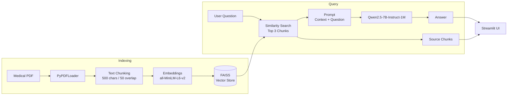

# Medical RAG Chatbot

A Retrieval-Augmented Generation (RAG) chatbot that answers questions using a medical PDF as its knowledge source. It uses **FAISS** for semantic retrieval and **Qwen2.5-7B-Instruct-1M** for answer generation, with retrieved source passages shown alongside each response.

## Features

- PDF ingestion and text chunking (500 characters, 50 overlap)
- Semantic search using `all-MiniLM-L6-v2` embeddings
- FAISS vector store for efficient similarity search
- Qwen2.5-7B-Instruct-1M via Hugging Face `InferenceClient`
- Streamlit chat interface
- Displays top 3 retrieved source chunks
- CLI version for testing without the UI

## Architecture



## Tech Stack

| Component | Technology |
| --- | --- |
| Language | Python 3.12 |
| Framework | LangChain |
| PDF Parsing | PyPDF |
| Embeddings | `all-MiniLM-L6-v2` |
| Vector Store | FAISS |
| LLM | Qwen2.5-7B-Instruct-1M |
| LLM API | Hugging Face |
| UI | Streamlit |
| Dependency Management | Pipenv |

## Project Structure

```text
medical-chatbot-rag/
├── app.py
├── create_memory_for_llm.py
├── connect_memory_with_llm.py
├── Pipfile
├── Pipfile.lock
├── requirements.txt
├── data/
└── vectorstore/
```

- `app.py` — Streamlit chatbot
- `create_memory_for_llm.py` — Builds the FAISS index
- `connect_memory_with_llm.py` — CLI RAG pipeline
- `data/` — Medical PDF files
- `vectorstore/` — Generated FAISS index

## Getting Started

### 1. Install Dependencies

```bash
pipenv install
```

Or:

```bash
pip install -r requirements.txt
```

### 2. Configure Hugging Face

Create a `.env` file in the project root:

```env
HF_TOKEN=your_huggingface_token
```

### 3. Add the Medical PDF

Place your PDF inside the `data/` directory:

```text
data/
└── your_medical_document.pdf
```

### 4. Build the Vector Store

```bash
pipenv run python create_memory_for_llm.py
```

This creates the FAISS index in `vectorstore/db_faiss/`.

### 5. Run the Application

```bash
pipenv run streamlit run app.py
```

For the CLI version:

```bash
pipenv run python connect_memory_with_llm.py
```

## Configuration

| Setting | Default |
| --- | --- |
| Chunk Size | 500 characters |
| Chunk Overlap | 50 characters |
| Retrieved Chunks | 3 |
| Embedding Model | `all-MiniLM-L6-v2` |
| LLM | `Qwen/Qwen2.5-7B-Instruct-1M` |
| Max Tokens | 512 |
| Temperature | 0.5 |

Rebuild the FAISS index if the embedding model or chunking configuration is changed.

## Limitations

- This is an educational project and **not medical advice**.
- Responses depend on the quality of document retrieval and the source PDF.
- Questions outside the indexed document may return a "not found" response.
- Chat history is displayed in the UI but is not currently passed to the LLM as conversational context.
- The FAISS index is generated locally and is not included in the repository.

